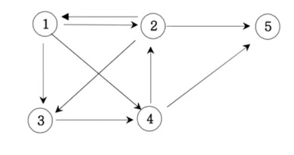

## 13. 경로 탐색(인접리스트, ArrayList)
*************************************************************************
### 설명

방향그래프가 주어지면 1번 정점에서 n번 정점으로 가는 모든 경로의 가지 수를 출력하는 프로그램을 작성하시오. 
아래 그래프에서 1번 정점에서 5번 정점으로 가는 가지 수는 다음과 같이 총 6가지 입니다. 

1 2 3 4 5 
1 2 5 
1 3 4 2 5 
1 3 4 5 
1 4 2 5 
1 4 5  

-------------------------------------------------------------------------
### 입력
첫째 줄에는 정점의 수 n(1<=n<=20)와 간선의 수 m이 주어진다;. 그 다음부터 m줄에 걸쳐 연결 정보가 주어진다. 

-------------------------------------------------------------------------
### 출력
총 가지수를 출력한다. 

| 예시 입력                                                                  | 결과  |
|------------------------------------------------------------------------|-----|
| 5 9 1 2 1 3 1 4 2 1 2 3 2 5 3 4 4 2 4 5  | 6   |

-------------------------------------------------------------------------