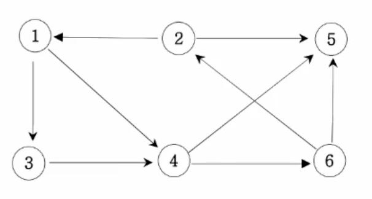

## 14. 그래프 최단거리(BFS)
*************************************************************************
### 설명

다음 그래프에서 1번 정점에서 각 정점으로 가는 최소 이동 간선 수를 출력하세요.

-------------------------------------------------------------------------
### 입력
첫째 줄에는 정점의 수 n(1<=n<=20)와 간선의 수 m이 주어진다. 그 다음부터 m줄에 걸쳐 연결 정보가 주어진다.

-------------------------------------------------------------------------
### 출력
1번 정점에서 각 정점으로 가는 최소 간선수를 2번 정점부터 차례대로 출력하세요.

| 예시 입력                                                                  | 결과  |
|------------------------------------------------------------------------|-----|
| 6 9 1 3 1 4 2 1 2 5 3 4 4 5 4 6 6 2 6 5  |2 : 3 3 : 1 4 : 1 5 : 2 6 : 2   |

-------------------------------------------------------------------------