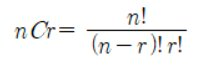
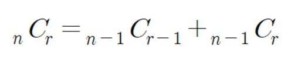

## 7. 조합의 경우수(메모이제이션)
*************************************************************************
### 설명
조합은 아래와 같이 계산합니다. 

하지만 여러분은 이 공식을 쓰지 않고 다음 공식을 사용하여 재귀를 이용해 조합수를 구해주는 프로그램을 작성하세요.

-------------------------------------------------------------------------
### 입력

첫째 줄에 자연수 n(3<=n<=33)과 r(0<=r<=n)이 입력됩니다.

-------------------------------------------------------------------------
### 출력
첫 번째 줄에 조합수를 출력합니다. 

| 예시 입력 | 결과  |
|-------|-----|
| 5 3   | 10  |

| 예시 입력  | 결과                                     |
|--------|----------------------------------------|
| 33 19  | 818809200 |

-------------------------------------------------------------------------